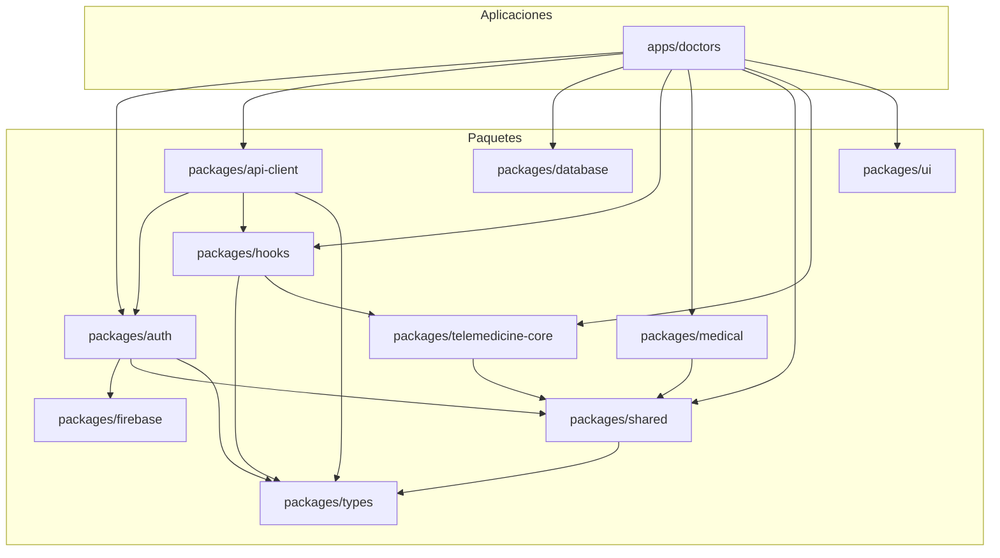

# Auditoría de Módulos y sus Interconexiones

Este documento detalla la arquitectura y las interconexiones de los módulos clave en el proyecto AltaMedica, incluyendo `shared`, `auth`, `doctor`, `firebase` y `telemedicine-core`.

## Resumen de la Arquitectura

El proyecto sigue una arquitectura de monorepo, con una clara separación de responsabilidades entre los paquetes. La aplicación principal para doctores, `apps/doctors`, consume servicios y componentes de varios paquetes reutilizables.

- **`apps/doctors`**: Actúa como la aplicación principal, integrando funcionalidades de otros módulos.
- **`packages/auth`**: Gestiona la autenticación y autorización.
- **`packages/firebase`**: Proporciona la capa de conexión con los servicios de Firebase.
- **`packages/shared`**: Ofrece utilidades y servicios comunes.
- **`packages/telemedicine-core`**: Contiene la lógica de negocio para la telemedicina.
- **`packages/database`**: Gestiona el acceso y la manipulación de la base de datos.

## Diagrama de Dependencias

## Análisis de Módulos

### 1. `packages/shared`

- **Propósito**: Proporciona servicios y utilidades compartidos, como logging, un cliente API base, configuración de entorno y procesamiento de pagos (Stripe, MercadoPago).
- **Dependencias Clave**: `@altamedica/types`.
- **Interconexiones**: Es una dependencia fundamental para `auth`, `telemedicine-core` y la aplicación `doctors`, proporcionando una base común de herramientas.

### 2. `packages/auth`

- **Propósito**: Módulo centralizado para la autenticación, gestión de sesiones, control de acceso basado en roles (RBAC) y autenticación de múltiples factores (MFA).
- **Dependencias Clave**: `@altamedica/firebase`, `@altamedica/shared`, `@altamedica/types`, `jsonwebtoken`, `otplib`.
- **Interconexiones**:
  - Consume `@altamedica/firebase` para la interacción con el proveedor de autenticación de Firebase.
  - Utiliza `@altamedica/shared` para funcionalidades comunes.
  - Es consumido por `apps/doctors` para proteger rutas y gestionar el estado de autenticación del usuario a través de sus hooks y componentes.

### 3. `apps/doctors` (Aplicación Principal)

- **Propósito**: Es la aplicación Next.js que sirve como portal para los doctores. Integra todas las funcionalidades necesarias para la gestión de citas, pacientes, prescripciones y telemedicina.
- **Dependencias Clave**: `@altamedica/api-client`, `@altamedica/auth`, `@altamedica/database`, `@altamedica/hooks`, `@altamedica/medical`, `@altamedica/shared`, `@altamedica/telemedicine-core`, `@altamedica/types`, `@altamedica/ui`.
- **Interconexiones**:
  - Utiliza `@altamedica/auth` para la seguridad y el manejo de sesiones.
  - Emplea `@altamedica/telemedicine-core` para las funcionalidades de videollamadas.
  - Se apoya en `@altamedica/database` para el acceso a datos.
  - Consume una amplia gama de otros paquetes para construir la interfaz de usuario y la lógica de negocio.

### 4. `packages/firebase`

- **Propósito**: Centraliza la configuración y utilidades de Firebase, ofreciendo inicialización tanto para el cliente como para el servidor (Admin SDK).
- **Dependencias Clave**: `firebase`, `firebase-admin`.
- **Interconexiones**: Es una dependencia crítica para `packages/auth`, que lo utiliza como proveedor de autenticación.

### 5. `packages/telemedicine-core`

- **Propósito**: Proporciona la lógica de negocio para las sesiones de telemedicina, incluyendo la creación y gestión de videollamadas y el monitoreo de la calidad del servicio (QoS) de WebRTC.
- **Dependencias Clave**: `@altamedica/shared`, `zod`.
- **Interconexiones**: Es utilizado por `apps/doctors` para implementar las funcionalidades de telemedicina.

## Flujo de Datos y Vinculación

1.  **Autenticación**:
    - Un doctor inicia sesión a través de `apps/doctors`.
    - `apps/doctors` utiliza el paquete `@altamedica/auth`.
    - `@altamedica/auth` se comunica con `@altamedica/firebase` para verificar las credenciales del usuario.
    - Una vez autenticado, `@altamedica/auth` genera un token de sesión y gestiona el estado del usuario.

2.  **Telemedicina**:
    - Un doctor inicia una consulta de telemedicina desde `apps/doctors`.
    - La aplicación utiliza `@altamedica/telemedicine-core` para crear y gestionar la sesión de video.
    - `@altamedica/telemedicine-core` maneja la lógica de WebRTC y la monitorización de la calidad de la llamada.

3.  **Acceso a Datos**:
    - La aplicación `apps/doctors` necesita acceder a datos de pacientes o citas.
    - Utiliza `@altamedica/database` (a través de repositorios) para consultar la base de datos.
    - Todos los datos se validan contra los esquemas definidos en `@altamedica/types`.

## Conclusión

La arquitectura del proyecto está bien estructurada, con una separación clara de responsabilidades que promueve la reutilización de código y la mantenibilidad. La aplicación `apps/doctors` funciona como un integrador de los diversos servicios proporcionados por los paquetes del monorepo, creando una plataforma robusta y cohesiva para los profesionales médicos.
