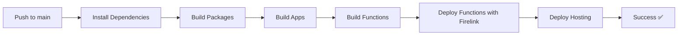

# 🚀 Guía de Deployment con Firebase y PNPM

## ✅ Configuración Completada

### 1. **Firebase Functions con @rxdi/firelink**

El proyecto está configurado para manejar dependencias locales del monorepo en Firebase Functions.

#### 📦 Configuración en `functions/package.json`:

```json
{
  "scripts": {
    "build": "tsc",
    "predeploy": "pnpm build",
    "deploy": "firelink deploy --only functions",
    "deploy:direct": "firebase deploy --only functions"
  },
  "devDependencies": {
    "@rxdi/firelink": "^0.7.46"
  },
  "fireDependencies": {
    "@altamedica/types": "../packages/types",
    "@altamedica/auth": "../packages/auth",
    "@altamedica/firebase": "../packages/firebase",
    "@altamedica/shared": "../packages/shared"
  }
}
```

### 2. **GitHub Actions Workflows Actualizados**

Los workflows ahora usan Firelink para el deployment de functions:

- **Staging Deploy**: Automático en push a `develop`
- **Production Deploy**: Automático en push a `main`

### 3. **Archivos de Configuración Creados**

- ✅ `firebase.json` - Configuración principal de Firebase
- ✅ `functions/.firelinkrc` - Configuración de Firelink
- ✅ `functions/tsconfig.json` - TypeScript con referencias a paquetes locales
- ✅ `.github/workflows/ci-optimized.yml` - Workflow actualizado con Firelink

## 🔧 Comandos de Deployment

### Local Development:

```bash
# Instalar dependencias
cd functions
pnpm install

# Build local
pnpm build

# Emuladores
pnpm serve

# Deploy directo (sin Firelink)
pnpm deploy:direct
```

### Production Deploy:

```bash
# Deploy con Firelink (resuelve dependencias locales)
cd functions
pnpm deploy

# O desde el root
pnpm --filter functions deploy
```

## 🔑 Secrets Requeridos en GitHub

Configura estos secrets en tu repositorio:

1. **FIREBASE_TOKEN**:
   ```bash
   firebase login:ci
   ```
   Copia el token generado

2. **FIREBASE_PROJECT_ID**:
   - Tu ID de proyecto de Firebase (ej: `altamedica-prod`)

3. **FIREBASE_SERVICE_ACCOUNT** (opcional):
   - Para autenticación con service account en lugar de token

## 📊 Flujo de CI/CD



## 🚨 Troubleshooting

### Error: "Cannot resolve workspace:* dependencies"

**Solución**: Firelink ya está configurado para resolver esto automáticamente.

### Error: "Module not found" en Functions

**Solución**: Verifica que el paquete esté listado en `fireDependencies`.

### Error: "FIREBASE_TOKEN invalid"

**Solución**: Regenera el token:
```bash
firebase logout
firebase login:ci
```

## 🎯 Ventajas de esta Configuración

1. **Resolución Automática**: Firelink maneja las dependencias `workspace:*`
2. **Cache Optimizado**: PNPM y Turbo cache aceleran los builds
3. **Type Safety**: TypeScript con referencias mantiene tipos consistentes
4. **Deploy Separado**: Functions y hosting se despliegan independientemente
5. **Rollback Fácil**: Cada deployment es versionado

## 📝 Checklist de Validación

- [x] Firebase Functions configurado con Firelink
- [x] Workflows de GitHub Actions actualizados
- [x] Dependencias locales mapeadas en `fireDependencies`
- [x] TypeScript configurado con referencias
- [x] Scripts de deployment optimizados
- [x] Node 20 y PNPM 9 configurados
- [ ] Secrets de GitHub configurados (manual)
- [ ] Primer deployment exitoso (pendiente)

## 🔄 Próximos Pasos

1. **Configurar Secrets en GitHub**:
   - Ve a Settings → Secrets → Actions
   - Agrega FIREBASE_TOKEN y FIREBASE_PROJECT_ID

2. **Test Local**:
   ```bash
   cd functions
   pnpm install
   pnpm build
   ```

3. **Deploy Manual**:
   ```bash
   cd functions
   pnpm deploy
   ```

4. **Push y Deploy Automático**:
   ```bash
   git add -A
   git commit -m "feat: Firebase deployment with Firelink"
   git push origin main
   ```

## 📚 Referencias

- [Firelink Documentation](https://github.com/rxdi/firelink)
- [Firebase Functions with PNPM](https://firebase.google.com/docs/functions/get-started)
- [GitHub Actions for Firebase](https://github.com/firebase/firebase-tools)

---

**Configuración completada por Claude ✨**