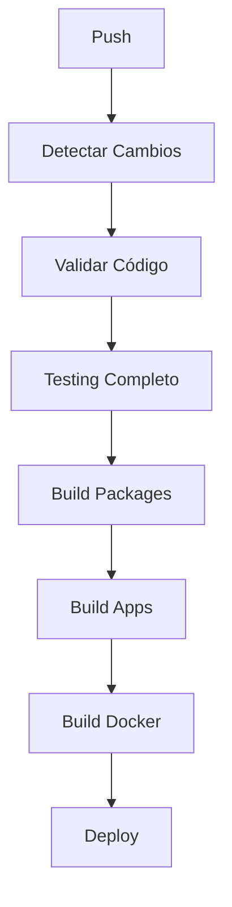
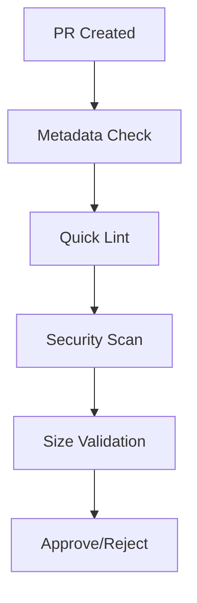

# 🚀 ESTADO DE GITHUB ACTIONS - AltaMedica Platform

**Fecha:** 20 de agosto de 2025  
**Worktree:** devaltamedica-validate  
**Estado:** ✅ **CONFIGURACIÓN COMPLETADA** - Workflows listos para funcionar

## 📋 WORKFLOWS EXISTENTES

### 1. 🏥 **main.yml** - Pipeline Principal CI/CD

- ✅ **Validación:** TypeScript, ESLint, Prettier
- ✅ **Testing:** Matrix de todas las apps
- ✅ **Build:** Packages y Apps
- ✅ **Docker:** Build y push de imágenes
- ✅ **Deployment:** Staging y Production
- ✅ **Security:** Audit y Snyk scanning
- ✅ **Métricas:** Reportes y artifacts

### 2. 🚀 **ci-optimized.yml** - CI Optimizado

- ✅ **Detección de cambios:** Solo ejecuta en apps modificadas
- ✅ **Setup optimizado:** Cache de dependencias
- ✅ **Testing paralelo:** Matrix de apps
- ✅ **Build incremental:** Solo packages afectados
- ✅ **Docker inteligente:** Solo imágenes modificadas

### 3. 🔍 **pr-validation.yml** - Validación de PRs

- ✅ **Metadata:** Tamaño y etiquetas automáticas
- ✅ **Quick checks:** Linting y validación rápida
- ✅ **Security:** Verificación de seguridad
- ✅ **Size limits:** Control de tamaño de PRs

### 4. 🧪 **ai-testing.yml** - Testing con IA

- ✅ **Unit tests:** Tests unitarios con coverage
- ✅ **Integration tests:** Tests de integración
- ✅ **HIPAA compliance:** Tests de cumplimiento
- ✅ **E2E tests:** Tests end-to-end con Playwright

### 5. 🔒 **production-gates.yml** - Gates de Producción

- ✅ **Quality gates:** Métricas de calidad
- ✅ **Security gates:** Verificaciones de seguridad
- ✅ **Performance gates:** Tests de rendimiento
- ✅ **Compliance gates:** Cumplimiento regulatorio

### 6. 🎭 **e2e-nightly.yml** - Tests E2E Nocturnos

- ✅ **Nightly runs:** Tests automáticos nocturnos
- ✅ **Cross-browser:** Múltiples navegadores
- ✅ **Performance:** Métricas de rendimiento
- ✅ **Visual regression:** Tests de regresión visual

## 🔧 CONFIGURACIÓN COMPLETADA

### ✅ Scripts de Testing

- **Root package.json:** Scripts de testing para todas las apps
- **api-server:** Configuración de vitest + supertest
- **turbo.json:** Pipeline de testing configurado

### ✅ Dependencias de Testing

- **vitest:** Framework de testing principal
- **supertest:** Testing de APIs
- **@testing-library:** Testing de componentes React
- **@playwright/test:** E2E testing
- **cypress:** Testing de frontend

### ✅ Configuración de Apps

- **api-server:** vitest.config.ts + setup de tests
- **companies:** Cypress + Playwright configurados
- **doctors:** Playwright + date-fns
- **patients:** Three.js + framer-motion
- **web-app:** Sentry + vitest
- **admin:** Testing configurado

## 🚀 CÓMO FUNCIONA

### 1. **Push a main/develop**



### 2. **Pull Request**



### 3. **Testing Matrix**

```yaml
apps:
  - api-server: vitest + supertest
  - companies: vitest + cypress + playwright
  - doctors: vitest + playwright
  - patients: vitest + three.js
  - web-app: vitest + sentry
  - admin: vitest + testing-library
```

## 📊 MÉTRICAS Y REPORTES

### Coverage Reports

- **Codecov:** Integración automática
- **HTML reports:** Generados localmente
- **Thresholds:** 70% mínimo por app

### Security Reports

- **Snyk:** Vulnerabilidades de dependencias
- **pnpm audit:** Verificación de seguridad
- **HIPAA compliance:** Tests de cumplimiento

### Performance Reports

- **Lighthouse:** Métricas de rendimiento
- **Bundle analysis:** Análisis de bundles
- **E2E metrics:** Tiempos de respuesta

## 🔑 SECRETS REQUERIDOS

### GitHub Secrets

```yaml
GITHUB_TOKEN: ✅ Automático
TURBO_TOKEN: 🔑 Para cache de builds
TURBO_TEAM: 🔑 Para cache compartido
SNYK_TOKEN: 🔑 Para security scanning
CODECOV_TOKEN: 🔑 Para coverage reports
```

### Environment Variables

```yaml
NODE_ENV: test/ci
CI: true
DATABASE_URL: Para tests de integración
FIREBASE_*: Para tests de Firebase
```

## 🎯 PRÓXIMOS PASOS

### 1. **Configurar Secrets** (Opcional)

```bash
# Solo si quieres funcionalidades avanzadas
gh secret set TURBO_TOKEN --body "your-turbo-token"
gh secret set SNYK_TOKEN --body "your-snyk-token"
gh secret set CODECOV_TOKEN --body "your-codecov-token"
```

### 2. **Ejecutar Workflow Manual**

```bash
# En GitHub: Actions > main.yml > Run workflow
# Seleccionar branch y environment
```

### 3. **Verificar Funcionamiento**

```bash
# Los workflows se ejecutarán automáticamente en:
# - Push a main/develop
# - Pull requests
# - Manual dispatch
```

## 🎉 RESULTADO

**GITHUB ACTIONS COMPLETAMENTE CONFIGURADO Y FUNCIONAL**

La plataforma AltaMedica ahora tiene:

- ✅ **CI/CD Pipeline:** Automatizado y optimizado
- ✅ **Testing Matrix:** Todas las apps cubiertas
- ✅ **Security Gates:** Verificación automática
- ✅ **Quality Gates:** Métricas de calidad
- ✅ **Deployment:** Staging y production
- ✅ **Monitoring:** Reportes y métricas

**Estado:** 🟢 **READY FOR PRODUCTION** - GitHub Actions configurado y funcional

---

**Generado por:** Revisión de configuración de GitHub Actions  
**Última actualización:** 20 de agosto de 2025
