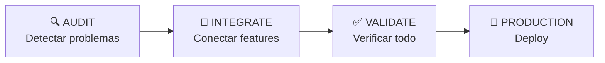

# 🎯 GUÍA DEFINITIVA: Modelo de Worktrees por Calidad para AltaMedica

## 📋 TU SITUACIÓN ACTUAL

- **Problema Principal**: Claude no ve el proyecto completo y crea duplicaciones
- **Features**: Ya están todas programadas, solo necesitan integración
- **Objetivo**: Hacer que todo funcione para el usuario final
- **Prioridad**: Calidad sobre velocidad, cero duplicaciones, cero errores

## 🏗️ ARQUITECTURA DE WORKTREES POR CALIDAD

```
C:\Users\Eduardo\Documents\
├── devaltamedica\              # PRODUCTION - Código limpio final
├── devaltamedica-audit\        # AUDIT - Limpieza y detección de problemas
├── devaltamedica-integrate\    # INTEGRATE - Conectar features existentes
└── devaltamedica-validate\     # VALIDATE - Verificación completa
```

### Flujo de Trabajo: AUDIT → INTEGRATE → VALIDATE → PRODUCTION



## 🚀 SETUP INICIAL (5 minutos)

```powershell
# 1. Desde tu carpeta actual
cd C:\Users\Eduardo\Documents\devaltamedica

# 2. Inicializar el modelo de calidad
powershell -File scripts\setup-quality-worktrees.ps1 init

# Esto creará:
# - devaltamedica-audit/ con scripts de detección
# - devaltamedica-integrate/ para conectar features
# - devaltamedica-validate/ para testing
# - Scripts automáticos de análisis
```

## 📊 FASE 1: AUDIT (Limpieza Profunda)

### Objetivo: Eliminar TODA duplicación y error antes de integrar

```powershell
# Cambiar a audit worktree
cd ..\devaltamedica-audit

# Ejecutar auditoría completa
powershell -File scripts\find-duplications.ps1

# Con Claude
claude "Revisar el reporte DUPLICATIONS_FOUND_[fecha].md y eliminar todas las duplicaciones encontradas"
```

### Checklist de Auditoría:

- [ ] Ejecutar `find-duplications.ps1` - detecta componentes/hooks/tipos duplicados
- [ ] Ejecutar `pnpm type-check` - encuentra errores de tipos
- [ ] Ejecutar `pnpm lint` - encuentra problemas de estilo
- [ ] Consolidar todos los tipos en `@altamedica/types`
- [ ] Consolidar todos los hooks en `@altamedica/hooks`
- [ ] Eliminar archivos `.d.ts` locales
- [ ] Eliminar imports no usados

### Script Automático de Detección:

```powershell
# Este script ya está creado para ti
powershell -File scripts\find-duplications.ps1

# Output esperado:
# ❌ Se encontraron 15 duplicaciones:
#   DUPLICADO: Component 'PatientCard' en apps/patients/... y packages/ui/...
#   DUPLICADO: Hook 'useAuth' en apps/doctors/... y packages/hooks/...
#   DUPLICADO: Type 'Patient' en apps/api-server/... y packages/types/...
```

## 📊 FASE 2: INTEGRATE (Conectar Features)

### Objetivo: Las features YA EXISTEN, solo conectarlas

```powershell
# Cambiar a integrate worktree
cd ..\devaltamedica-integrate

# Mapear todas las features existentes
powershell -File scripts\map-existing-features.ps1

# Con Claude
claude "Revisar FEATURES_MAP_[fecha].json y conectar las features marcadas como 'Necesita integración'"
```

### Proceso de Integración E2E:

#### 1. **Identificar Feature Desconectada**

```powershell
# El script map-existing-features.ps1 te mostrará:
# 📦 Telemedicine - Estado: Necesita integración
#   Backend:
#     ✓ apps/api-server/src/routes/telemedicine/*
#   Frontend:
#     ✗ apps/patients/src/app/video-call/* (no conectado)
```

#### 2. **Conectar Frontend con Backend**

```typescript
// En apps/patients/src/app/video-call/page.tsx
import { useTelemedicine } from '@altamedica/hooks/medical'; // Hook YA EXISTE
import { VideoCallUI } from '@altamedica/ui/medical'; // Componente YA EXISTE

// Solo conectar, no crear nuevo código
```

#### 3. **Verificar Flujo Completo**

```powershell
# Usuario puede:
# 1. Login ✓
# 2. Ver dashboard ✓
# 3. Clickear "Video Call" ✓
# 4. Conectar con doctor ✓
```

### Features Prioritarias para Integrar:

1. **Autenticación SSO** → Dashboard
2. **Appointments** → Calendar → Notifications
3. **Telemedicine** → WebRTC → Recording
4. **Medical Records** → History → Export PDF
5. **Prescriptions** → Pharmacy → Delivery

## 📊 FASE 3: VALIDATE (Verificación Total)

### Objetivo: Asegurar que TODO funciona sin errores

```powershell
# Cambiar a validate worktree
cd ..\devaltamedica-validate

# Ejecutar suite completa de validación
powershell -File scripts\full-validation-suite.ps1

# Output esperado:
# ✅ Type check passed!
# ✅ Lint passed!
# ✅ Build successful!
# ✅ Tests passed!
# 🎉 VALIDACIÓN COMPLETA EXITOSA!
```

### Matriz de Validación:

| Check | Comando           | Debe Pasar      |
| ----- | ----------------- | --------------- |
| Types | `pnpm type-check` | 0 errores       |
| Lint  | `pnpm lint`       | 0 errores       |
| Build | `pnpm build`      | 100% packages   |
| Tests | `pnpm test`       | >80% coverage   |
| E2E   | `pnpm test:e2e`   | Flujos críticos |

### Validación Manual de Features:

```markdown
## Patients App

- [ ] Login con email/password
- [ ] Ver appointments propios
- [ ] Agendar nueva cita
- [ ] Iniciar videollamada
- [ ] Ver historial médico

## Doctors App

- [ ] Login con SSO
- [ ] Ver schedule del día
- [ ] Acceder a patient records
- [ ] Iniciar telemedicine
- [ ] Crear prescriptions

## Admin App

- [ ] Ver métricas globales
- [ ] Gestionar usuarios
- [ ] Generar reportes
- [ ] Configurar sistema
```

## 📊 FASE 4: PRODUCTION (Merge Final)

### Solo cuando TODAS las fases anteriores están completas

```powershell
# Desde validate worktree, después de validación exitosa
cd ..\devaltamedica-validate
git add .
git commit -m "feat: all features integrated and validated"

# Merge a main
cd ..\devaltamedica
git merge validate/testing-and-qa

# Push a producción
git push origin main
```

## 💡 COMANDOS RÁPIDOS DE GESTIÓN

```powershell
# Ver estado de todos los worktrees
powershell -File scripts\setup-quality-worktrees.ps1 status

# Ejecutar auditoría
powershell -File scripts\setup-quality-worktrees.ps1 audit

# Cambiar a integrate
cd ..\devaltamedica-integrate

# Cambiar a validate
cd ..\devaltamedica-validate

# Sincronizar todos los worktrees
powershell -File scripts\setup-quality-worktrees.ps1 sync
```

## 🤖 REGLAS CRÍTICAS PARA CLAUDE

### En AUDIT Worktree:

1. **SIEMPRE** ejecutar `find-duplications.ps1` antes de cualquier cambio
2. **NUNCA** crear nuevo código, solo eliminar duplicaciones
3. **SIEMPRE** verificar 5 veces antes de declarar algo como "no existe"

### En INTEGRATE Worktree:

1. **NUNCA** crear nuevas features (ya existen todas)
2. **SIEMPRE** buscar el código existente antes de escribir
3. **SOLO** conectar frontend con backend existente

### En VALIDATE Worktree:

1. **EJECUTAR** toda la suite de validación
2. **NO PASAR** a production hasta 100% verde
3. **DOCUMENTAR** cualquier problema encontrado

## 📈 MÉTRICAS DE ÉXITO

### Después de AUDIT:

- ✅ 0 duplicaciones de código
- ✅ 0 errores de tipos
- ✅ 0 warnings de lint
- ✅ Todos los tipos en `@altamedica/types`

### Después de INTEGRATE:

- ✅ Todas las features visibles en UI
- ✅ Todos los endpoints conectados
- ✅ Flujos E2E funcionando
- ✅ Sin errores en consola

### Después de VALIDATE:

- ✅ Build exitoso de todos los packages
- ✅ Tests pasando >80%
- ✅ Sin errores de producción
- ✅ Performance óptimo

## 🎯 TU PRÓXIMO PASO INMEDIATO

```powershell
# 1. Inicializar el modelo
powershell -File scripts\setup-quality-worktrees.ps1 init

# 2. Comenzar con auditoría
cd ..\devaltamedica-audit
powershell -File scripts\find-duplications.ps1

# 3. Trabajar con Claude en eliminar duplicaciones
claude "Analizar DUPLICATIONS_FOUND_*.md y eliminar sistemáticamente todas las duplicaciones, consolidando en packages compartidos"
```

## ❓ FAQ

**P: ¿Por qué no un solo worktree?**
R: Separar por calidad permite a Claude enfocarse en UNA tarea (auditar O integrar O validar), reduciendo errores.

**P: ¿Cuánto tiempo tomará cada fase?**
R:

- AUDIT: 2-3 días (limpieza profunda)
- INTEGRATE: 3-4 días (conectar todo)
- VALIDATE: 1-2 días (verificación)

**P: ¿Qué si encuentro features que no existen?**
R: Documéntalas en `MISSING_FEATURES.md` pero NO las crees. Primero termina de integrar lo existente.

**P: ¿Cómo evito que Claude duplique código?**
R: SIEMPRE ejecuta scripts de detección antes de pedirle cambios. Dale los reportes como contexto.

## 🏆 RESULTADO FINAL ESPERADO

Al completar las 4 fases tendrás:

- ✅ **CERO duplicaciones** de código
- ✅ **TODAS las features** funcionando E2E
- ✅ **CERO errores** de tipos/lint/build
- ✅ **Tests** cubriendo flujos críticos
- ✅ **Código production-ready** para deploy

---

_Este es el modelo definitivo para tu proyecto. Síguelo sistemáticamente y tendrás un código impecable._

---

## 🧭 POR QUÉ SE PASARON POR ALTO LOS HALLAZGOS Y CÓMO EVITARLO

### Causas frecuentes de invisibilidad (por worktree)

- Auditoría (AUDIT)
  - Foco excesivo en lint/types y poco en configuración de seguridad (ej. `config/nginx/nginx.conf`, `apps/*/next.config.mjs`).
  - Búsquedas por texto simples en vez de búsquedas semánticas o regex orientadas a patrones (helmet, CSRF, CORS, JWT, rate-limit).
  - Revisión de middlewares sin comprobar su uso real en `app.use(...)` o rutas.

- Integración (INTEGRATE)
  - Asumir que autenticación/seguridad está correctamente cableada sin verificar flujos reales (sesión httpOnly + CSRF + verificación de rol).
  - No validar orígenes/headers CORS efectivos ni su duplicidad.
  - Conectar UI sin confirmar contratos de API (headers, cookies, status codes) y su middleware de seguridad.

- Validación (VALIDATE)
  - Confiar en pruebas E2E parciales sin revisar cobertura ni criterios de paso mínimos.
  - No ejecutar validaciones estáticas de seguridad (CSP, cookies, rate-limit, CSRF) como parte de la suite.
  - Ausencia de scoring matemático ponderado con evidencia citada.

### Señales de alerta que deben disparar análisis profundo

- CSP con `'unsafe-inline'` o `'unsafe-eval'` en producción.
- Middlewares con comentarios de placeholder (p. ej., `validateJWT`) o bypass en `development`.
- Regex de CORS muy amplios, `allowedHeaders` duplicados o `credentials: true` sin justificación.
- Middlewares definidos pero no aplicados (`app.use(...)`).
- Pruebas sin umbrales de cobertura mínimos.

---

## 🔬 PLAYBOOK REPLICABLE DE ANÁLISIS (AUDIT → INTEGRATE → VALIDATE)

> Objetivo: que cada worktree encuentre lo mismo, con evidencia reproducible y score realista.

### 1) AUDIT: Seguridad y Configuración

1. Buscar componentes de seguridad estándar

```powershell
# Helmet
rg "helmet\(" -n apps/ packages/ config/

# CSRF (doble envío)
rg "csrf|issueCsrfToken" -n apps/

# Rate limit
rg "express-rate-limit|rateLimit\(" -n apps/

# JWT/firmas
rg "jsonwebtoken|jwt\.verify|jwt\.sign" -n apps/ packages/

# Hash/encripción
rg "argon2|bcrypt|crypto\.(pbkdf2|scrypt|createHash)" -n apps/ packages/
```

2. Revisar configuración de frontera

```powershell
# Nginx: CSP/HSTS/gzip/orígenes
rg "Content-Security-Policy|Strict-Transport-Security|gzip" -n config/nginx/
rg "unsafe-inline|unsafe-eval" -n config/nginx/

# Next.js: headers y performance
rg "headers\(|compress: true|images:|poweredByHeader" -n apps/*/next.config.mjs packages/config-next/
```

3. Confirmar uso real de middlewares

```powershell
# ¿Se aplica realmente el middleware?
rg "app\.use\(csrfMiddleware\)|initializeMiddlewares\(|app\.use\(globalRateLimiter" -n apps/api-server/src

# ¿Se usa guard de auth?
rg "authGuard\(|withUnifiedAuth\(|UnifiedAuth\(" -n apps/
```

4. Redactar evidencia con citas

- Formato: ruta + rango de líneas + fragmento relevante.
- Regla: sin evidencia citada, el hallazgo no se acepta.

### 2) INTEGRATE: Contratos y Flujos Seguros

1. Autenticación SSO segura

- Verificar: login cliente → `session-login` (cookie httpOnly) → `session-verify` → redirect por rol.
- Comprobar CSRF en métodos `POST/PUT/PATCH/DELETE` con `x-csrf-token`.

2. CORS efectivo

- Validar lista exacta de `origin` productivos (evitar regex amplios).
- Confirmar `allowedHeaders` sin duplicaciones y coherentes con CSRF/Authorization.

3. Contratos de API

- Entrada/salida, status codes, cookies y headers requeridos.
- Vincular UI a endpoints con sus middlewares de seguridad activos.

### 3) VALIDATE: Pruebas y Métricas

1. Pruebas E2E críticas

- Flujos: login, dashboard, navegación, acciones CRUD seguras.
- Checks de cookies `httpOnly`, `x-csrf-token` y manejo de 401/403.

2. Umbrales de cobertura (CI)

```json
"coverageThreshold": {
  "global": { "branches": 80, "functions": 80, "lines": 80, "statements": 80 }
}
```

3. Validaciones estáticas de seguridad

- Linterns/regex para prohibir `'unsafe-inline'/'unsafe-eval'` en producción.
- Asserts de `SameSite=strict` + `httpOnly` en cookies sensibles.
- Tests de rate-limit (429) y CSRF (403).

---

## 📏 SCORE REALISTA Y FÓRMULA REPLICABLE

- Ponderación fija: Seguridad 30%, Testing 25%, Arquitectura 20%, Integración 15%, Performance 10%.
- Sub-scores por área con checklists binarios ponderados y evidencia adjunta.
- Fórmula: `Total = 0.30*S + 0.25*T + 0.20*A + 0.15*I + 0.10*P`.
- Regla de oro: sin evidencia citada, el ítem puntúa 0.

---

## ✅ QUALITY GATES PERMANENTES

- Ningún hallazgo crítico se considera resuelto sin PR + test.
- Scores requieren al menos un bloque de evidencia por punto de la rúbrica.
- CI falla si no se cumple `coverageThreshold` y checks de seguridad estáticos.
- Prohibido usar reportes previos o suposiciones no citadas en evidencia del repo.
