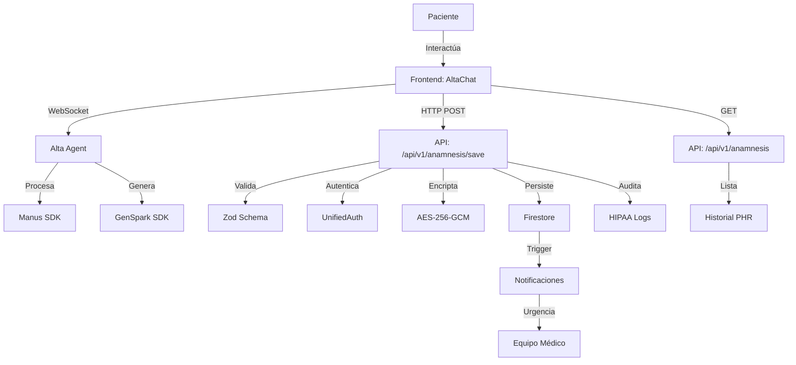

# 🏥 Arquitectura E2E de Alta - Asistente Médica con IA

## 🎯 Visión General

Alta es un sistema completo end-to-end (E2E) de anamnesis médica con IA que abarca:
- **Frontend**: Interfaz conversacional con avatar 3D
- **Backend**: APIs RESTful con persistencia segura
- **Agentes IA**: Manus (NLP médico) + GenSpark (generación dinámica)
- **Base de Datos**: Firestore + PostgreSQL con encriptación PHI
- **Compliance**: HIPAA, auditoría completa, encriptación AES-256

## 📊 Flujo de Datos E2E



## 📦 Estructura del Sistema

### 1. Frontend Components (`packages/alta-agent/`)

```typescript
// Componentes principales
├── src/
│   ├── components/
│   │   ├── AltaChat.tsx         # Interfaz de chat principal
│   │   └── AltaAvatar3D.tsx     # Avatar 3D con Three.js
│   ├── core/
│   │   ├── AltaAgent.ts         # Lógica base del agente
│   │   └── AltaAgentWithAI.ts   # Integración con Manus/GenSpark
│   └── types/
│       └── alta.types.ts        # Tipos TypeScript + Zod
```

### 2. Backend Endpoints (`apps/api-server/src/app/api/v1/anamnesis/`)

| Endpoint | Método | Propósito | Autenticación |
|----------|--------|-----------|---------------|
| `/save` | POST | Guardar anamnesis completa | Patient only |
| `/` | GET | Listar historial anamnesis | Patient/Doctor/Admin |
| `/[id]` | GET | Obtener anamnesis específica | Con permisos |
| `/[id]` | DELETE | Eliminar anamnesis (soft) | Admin only |

### 3. Modelos de Datos

#### Anamnesis Schema (Zod)
```typescript
const AnamnesisSchema = z.object({
  patientId: z.string().uuid(),
  summary: z.object({
    // Datos clínicos
    chiefComplaint: z.string(),
    symptoms: z.array(SymptomSchema),
    medicalHistory: MedicalHistorySchema,
    familyHistory: FamilyHistorySchema,
    socialHistory: SocialHistorySchema,
    vitalSigns: VitalSignsSchema,
    physicalExam: PhysicalExamSchema,
    assessment: AssessmentSchema,
    
    // Metadata de Alta
    altaMetadata: z.object({
      mode: z.enum(['preventive', 'illness', 'emergency', 'followup']),
      sessionDuration: z.number(),
      completionRate: z.number(),
      aiInsights: z.array(z.string()),
      confidenceScore: z.number()
    })
  }),
  completedAt: z.string().datetime()
});
```

#### Personal Health Record (PHR)
```typescript
interface PersonalHealthRecord {
  // Datos demográficos
  demographics: Demographics;
  
  // Historia médica completa
  medicalHistory: {
    conditions: ChronicCondition[];
    surgeries: Surgery[];
    hospitalizations: Hospitalization[];
    allergies: Allergy[];
    medications: Medication[];
  };
  
  // Historia familiar
  familyHistory: FamilyMember[];
  
  // Historia social
  socialHistory: {
    occupation: string;
    lifestyle: LifestyleFactors;
    substanceUse: SubstanceUse;
  };
  
  // Cuidado preventivo
  preventiveCare: {
    vaccinations: Vaccination[];
    screenings: Screening[];
    checkups: Checkup[];
  };
  
  // Métricas baseline
  baselineMetrics: {
    vitalSigns: VitalSigns;
    labResults: LabResult[];
    bodyMetrics: BodyMetrics;
  };
}
```

## 🔐 Seguridad y Compliance

### Encriptación PHI
```typescript
// Todos los datos sensibles se encriptan antes de persistir
function encryptPHI(data: string): string {
  const cipher = crypto.createCipheriv(
    'aes-256-gcm',
    Buffer.from(process.env.ENCRYPTION_KEY, 'hex'),
    iv
  );
  // ... implementación completa
  return encrypted;
}
```

### Auditoría HIPAA
```typescript
// Cada acción médica se registra
await auditService.logAccess({
  userId: user.id,
  action: 'CREATE_ANAMNESIS',
  resource: `anamnesis/${id}`,
  patientId: patientId,
  metadata: { /* detalles */ },
  ip: request.ip,
  timestamp: new Date()
});
```

## 🤖 Integración con Agentes IA

### Manus SDK - Procesamiento NLP Médico
```typescript
class ManusIntegration {
  async analyzeSymptoms(text: string): Promise<MedicalAnalysis> {
    // Extracción de entidades médicas
    const entities = await this.extractMedicalEntities(text);
    
    // Detección de urgencias
    const urgency = await this.detectUrgency(entities);
    
    // Diagnóstico diferencial
    const differential = await this.getDifferentialDiagnosis(entities);
    
    return { entities, urgency, differential };
  }
}
```

### GenSpark SDK - Generación Dinámica
```typescript
class GenSparkIntegration {
  async generateMedicalReport(data: AnamnesisData): Promise<MedicalDocument> {
    // Generar documento médico estructurado
    const report = await this.createStructuredReport(data);
    
    // Generar recomendaciones personalizadas
    const recommendations = await this.generateRecommendations(data);
    
    // Exportar en múltiples formatos
    return this.exportDocument(report, ['PDF', 'FHIR', 'HTML']);
  }
}
```

## 🚀 Flujos Críticos

### 1. Anamnesis de Emergencia
```typescript
// Detección automática de urgencias
if (urgencyLevel === 'emergency') {
  // 1. Notificar equipo médico inmediatamente
  await notificationService.alertMedicalTeam({
    priority: 'CRITICAL',
    patient: patientId,
    symptoms: criticalSymptoms
  });
  
  // 2. Crear cita de emergencia
  await appointmentService.createEmergencySlot({
    patientId,
    availableIn: '1 hour'
  });
  
  // 3. Preparar sala de emergencias
  await emergencyService.prepareRoom({
    patient: patientData,
    expectedArrival: estimatedTime
  });
}
```

### 2. Anamnesis Preventiva
```typescript
// Recopilación de datos históricos
if (mode === 'preventive') {
  // 1. Actualizar perfil de salud
  await updateHealthProfile(patientId, {
    lastCheckup: new Date(),
    baselineMetrics: vitalSigns,
    riskFactors: identifiedRisks
  });
  
  // 2. Generar recomendaciones preventivas
  const preventiveActions = await generatePreventiveCare({
    age: patient.age,
    gender: patient.gender,
    history: medicalHistory,
    lifestyle: socialHistory
  });
  
  // 3. Programar seguimientos
  await scheduleFollowUps(preventiveActions);
}
```

## 📊 Métricas y Analytics

```typescript
// Métricas recopiladas por sesión
interface AltaSessionMetrics {
  // Performance
  sessionDuration: number;        // minutos
  questionsAsked: number;         // cantidad
  completionRate: number;         // porcentaje
  
  // Calidad
  dataCompleteness: number;       // 0-100%
  confidenceScore: number;        // 0-1
  aiProcessingTime: number;       // ms
  
  // Clínicas
  symptomsIdentified: number;
  urgencyDetections: number;
  differentialCount: number;
}
```

## 🧪 Testing E2E

### Unit Tests
```typescript
describe('AltaAgent', () => {
  it('should detect emergency symptoms', async () => {
    const agent = new AltaAgentWithAI();
    const response = await agent.processMessage('Tengo dolor en el pecho');
    expect(response.urgency).toBe('emergency');
  });
});
```

### Integration Tests
```typescript
describe('Anamnesis API', () => {
  it('should save complete anamnesis', async () => {
    const response = await request(app)
      .post('/api/v1/anamnesis/save')
      .send(mockAnamnesisData)
      .expect(201);
    
    expect(response.body.anamnesisId).toBeDefined();
    expect(auditLog).toHaveBeenCalled();
  });
});
```

### E2E Tests (Playwright)
```typescript
test('Complete anamnesis flow', async ({ page }) => {
  // 1. Navegar a Alta
  await page.goto('/alta-anamnesis');
  
  // 2. Interactuar con chat
  await page.fill('[data-testid="alta-input"]', 'Tengo fiebre');
  await page.click('[data-testid="alta-send"]');
  
  // 3. Verificar respuesta
  await expect(page.locator('[data-testid="alta-response"]'))
    .toContainText('Cuánto tiempo');
  
  // 4. Completar sesión
  // ... más interacciones
  
  // 5. Verificar guardado
  await expect(page).toHaveURL('/dashboard?anamnesis=completed');
});
```

## 📈 Escalabilidad

### Costos Proyectados
```yaml
100 usuarios/mes:
  - APIs IA: $500/mes
  - Infraestructura: $200/mes
  - Total: $700/mes

1,000 usuarios/mes:
  - APIs IA: $3,000/mes
  - Infraestructura: $800/mes
  - Total: $3,800/mes

10,000 usuarios/mes:
  - APIs IA: $15,000/mes
  - Infraestructura: $3,000/mes
  - Total: $18,000/mes
```

### Optimizaciones
1. **Caché Inteligente**: Respuestas frecuentes en Redis
2. **Procesamiento Batch**: Agrupación de llamadas IA
3. **CDN para Assets**: Avatar 3D y recursos estáticos
4. **Queue System**: Bull para procesamiento asíncrono

## 🔧 Configuración

### Variables de Entorno
```bash
# Agentes IA
MANUS_API_KEY=xxx
GENSPARK_API_KEY=xxx

# Encriptación
ENCRYPTION_KEY=xxx # 32 bytes hex
ENCRYPTION_IV=xxx  # 16 bytes hex

# Firebase
FIREBASE_PROJECT_ID=altamedica
FIREBASE_CLIENT_EMAIL=xxx
FIREBASE_PRIVATE_KEY=xxx

# Notificaciones
TWILIO_ACCOUNT_SID=xxx # Para SMS emergencias
TWILIO_AUTH_TOKEN=xxx
SENDGRID_API_KEY=xxx # Para emails
```

## 🔮 Próximos Pasos

1. **Integración Real con Manus/GenSpark** - Reemplazar mocks
2. **Mejoras Avatar 3D** - Animaciones y expresiones faciales
3. **Soporte Multi-idioma** - Español, Inglés, Portugués
4. **Análisis Predictivo** - ML para predicción de riesgos
5. **Integración Wearables** - Apple Health, Google Fit
6. **Exportación FHIR** - Interoperabilidad con otros sistemas

---

**Desarrollado por Dr. Eduardo Marques (Medicina-UBA)**
Contacto: eduardo@altamedica.com