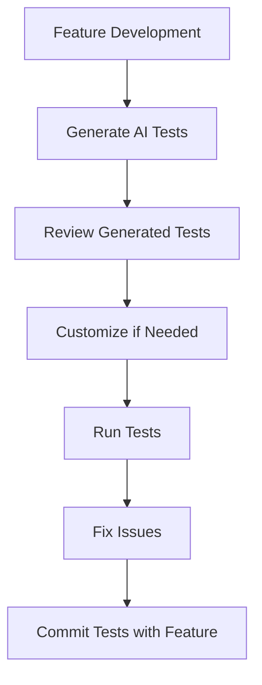

# 🤖 Playwright MCP Integration Guide

## Introducción a Playwright MCP

Playwright ha introducido **Model Context Protocol (MCP)** que permite a agentes de IA generar, ejecutar y auto-corregir tests E2E usando contexto estructurado del DOM, sin necesidad de modelos de visión. Esta guía documenta la integración completa en AltaMedica Platform.

## ⚡ Ventajas de MCP sobre Testing Tradicional

### Testing Manual vs AI-Generated

| Aspecto | Testing Manual | Playwright MCP |
|---------|----------------|----------------|
| **Velocidad** | Días para crear suite completa | Minutos para generar tests |
| **Precisión** | Dependiente de conocimiento del tester | Analiza DOM completo automáticamente |
| **Mantenimiento** | Actualización manual cuando cambia UI | Auto-adaptación a cambios estructurales |
| **Cobertura** | Limitada por tiempo disponible | Puede cubrir todos los flujos identificados |
| **Consistencia** | Varía entre testers | Sigue patrones consistentes siempre |

### Beneficios Específicos para AltaMedica

1. **Compliance HIPAA**: AI detecta automáticamente exposición de PHI
2. **Medical Workflows**: Comprende flujos médicos complejos
3. **Multi-App Testing**: Genera tests para todas las 7 aplicaciones
4. **WebRTC Testing**: Maneja videollamadas médicas automáticamente
5. **Accessibility**: Valida cumplimiento WCAG 2.2 AA automáticamente

## 🏗️ Arquitectura de la Integración

```
AltaMedica E2E Testing con MCP
│
├── 🔧 Configuración MCP
│   ├── .vscode/mcp.json                    # Configuración VS Code MCP
│   ├── packages/e2e-tests/mcp.config.js   # Configuración específica proyecto
│   └── packages/e2e-tests/playwright.config.ts # Config Playwright existente
│
├── 🤖 Generador de Tests IA
│   ├── packages/e2e-tests/ai-test-generator.js # Script generador principal
│   └── packages/e2e-tests/tests/ai-generated/  # Tests generados por IA
│
├── 📚 Templates de Test
│   ├── Patient Flows (booking, telemedicine, profile)
│   ├── Doctor Flows (consultation, schedule, prescriptions)
│   └── Company Flows (marketplace, job postings)
│
└── 🔍 Análisis Automático
    ├── DOM Structure Analysis
    ├── Accessibility Tree Parsing
    ├── User Journey Recognition
    └── Error Pattern Detection
```

## 📦 Instalación y Configuración

### 1. Configuración MCP en VS Code

El proyecto ya incluye `.vscode/mcp.json` con dos configuraciones:

```json
{
  "servers": {
    "playwright": {
      "command": "npx",
      "args": ["-y", "@executeautomation/playwright-mcp-server"],
      "capabilities": ["vision", "pdf"],
      "description": "Playwright MCP Server para generación automática de tests E2E"
    },
    "playwright-isolated": {
      "command": "npx",
      "args": ["-y", "@executeautomation/playwright-mcp-server", "--isolated"],
      "description": "Servidor MCP en modo aislado para tests limpios"
    }
  }
}
```

### 2. Configuración del Proyecto

El archivo `packages/e2e-tests/mcp.config.js` contiene configuración específica:

- **Base URLs** para todas las 7 aplicaciones
- **Patterns de testing** por dominio (médico, telemedicina, etc.)
- **Hints para IA** sobre selectors y user journeys comunes
- **Checks de seguridad HIPAA** automáticos

### 3. Instalar MCP Server

```bash
# Instalar servidor MCP globalmente
npx @executeautomation/playwright-mcp-server@latest

# O usar directamente (recomendado)
npx -y @executeautomation/playwright-mcp-server
```

## 🚀 Uso del Generador de Tests IA

### Comandos Disponibles

```bash
# Desde packages/e2e-tests/
cd packages/e2e-tests

# Ver templates disponibles
pnpm ai:list

# Generar test específico
pnpm ai:generate --app patients --flow booking
pnpm ai:generate --app doctors --flow consultation
pnpm ai:generate --app companies --flow marketplace

# Usando node directamente
node ai-test-generator.js --app patients --flow telemedicine
node ai-test-generator.js --list
```

### Templates Disponibles

#### 🏥 **Patients App**
- `booking`: Flujo completo de reserva de citas
- `telemedicine`: Sesiones de videollamada médica
- `profile`: Gestión de perfil y historial médico

#### 👨‍⚕️ **Doctors App**
- `consultation`: Gestión de consultas y registros médicos
- `schedule`: Administración de horarios y disponibilidad
- `telemedicine`: Conducir sesiones de telemedicina

#### 🏢 **Companies App**
- `marketplace`: Publicación y gestión de empleos médicos
- `applications`: Gestión de candidatos y aplicaciones

### Ejemplo de Generación

```bash
$ pnpm ai:generate --app patients --flow booking

🤖 Generating AI-powered E2E test: Patient Appointment Booking
📊 Analyzing application structure...
🧬 Generating test code...
✅ Test generated: tests/ai-generated/patients-booking-ai-generated.spec.ts
🔍 Validating generated test...
✅ Test validation passed

🎉 Test generated successfully!
📁 Location: tests/ai-generated/patients-booking-ai-generated.spec.ts

🚀 To run the test:
   pnpm test:e2e patients-booking-ai-generated.spec.ts
```

## 🔍 Características del AI Test Generator

### Análisis Automático del DOM

El generador utiliza MCP para:

1. **Accessibility Tree Analysis**: Identifica elementos por roles ARIA
2. **Semantic HTML Detection**: Encuentra elementos semánticamente correctos
3. **Data Attribute Discovery**: Prioriza `data-testid` cuando está disponible
4. **User Flow Recognition**: Comprende navegación típica de la aplicación

### Patrones de Selector Inteligentes

```typescript
// AI prioriza selectors en este orden:
1. '[data-testid="button-submit"]'           // Data attributes
2. 'button[aria-label="Submit Form"]'        // ARIA labels
3. 'button[type="submit"]'                   // Semantic attributes
4. '.submit-button'                          // Class names (último recurso)

// Ejemplo generado automáticamente:
const searchInput = page.getByLabel(/buscar doctor|search doctor/i);
const submitButton = page.getByRole('button', { name: /buscar|search/i });
```

### Tests Generados Incluyen:

- ✅ **Happy Path**: Flujo principal exitoso
- ✅ **Error Handling**: Casos de error y validación
- ✅ **Edge Cases**: Conflictos, datos faltantes, timeouts
- ✅ **Accessibility**: Verificación WCAG 2.2 AA
- ✅ **HIPAA Compliance**: Sin exposición de PHI
- ✅ **Performance**: Timeouts apropiados y waits inteligentes

## 📋 Ejemplo de Test AI-Generated

El archivo `tests/ai-generated/patients-booking-flow.spec.ts` muestra un ejemplo completo:

### Estructura del Test

```typescript
test.describe('Patient Appointment Booking Flow (AI-Generated)', () => {
  // Setup automático con autenticación
  test.beforeEach(async ({ page }) => {
    await authenticateAs(page, 'patient', 'test.patient@altamedica.mx');
  });

  // Test principal con steps estructurados
  test('should complete full appointment booking journey', async ({ page }) => {
    await test.step('Navigate to appointments', async () => {
      // AI detecta botón por accesibilidad
      await page.getByRole('button', { name: /citas|appointments/i }).click();
    });
    
    await test.step('Search for doctors', async () => {
      // AI encuentra input por label
      const searchInput = page.getByLabel(/buscar doctor|search doctor/i);
      await searchInput.fill('Cardiología');
    });
    
    // Más steps...
  });
});
```

### Features del Test Generado:

1. **Bilingual Support**: Soporta español e inglés automáticamente
2. **Accessibility-First**: Usa `getByRole`, `getByLabel`
3. **Error Resilience**: Maneja elementos que pueden no existir
4. **HIPAA Safe**: No expone datos sensibles
5. **Step Structure**: Tests organizados en steps claros

## 🔧 Configuración Avanzada

### Personalizar Configuración MCP

Edita `packages/e2e-tests/mcp.config.js`:

```javascript
module.exports = {
  // Configurar URLs base por ambiente
  baseURLs: {
    development: {
      api: 'http://localhost:3001',
      patients: 'http://localhost:3003'
    },
    staging: {
      api: 'https://staging-api.altamedica.mx',
      patients: 'https://staging-patients.altamedica.mx'
    }
  },
  
  // Agregar nuevos patrones de test
  testPatterns: {
    'custom-flow': {
      description: 'Flujo personalizado',
      priority: 'high',
      timeout: 60000
    }
  },
  
  // Configurar hints para IA
  aiHints: {
    selectors: {
      // Patrones específicos de tu aplicación
      patterns: {
        customButtons: '[data-cy="btn"], [data-testid*="btn"]'
      }
    }
  }
};
```

### Añadir Nuevos Templates

Edita `ai-test-generator.js` para agregar templates:

```javascript
const TEST_TEMPLATES = {
  // Apps existentes...
  
  admin: {
    dashboard: {
      name: 'Admin Dashboard Management',
      description: 'Administrative dashboard operations',
      priority: 'medium',
      userJourney: [
        'Login as admin',
        'View system metrics',
        'Manage users',
        'Generate reports'
      ]
    }
  }
};
```

## 🧪 Testing Strategy con MCP

### Flujo de Desarrollo Recomendado



### Niveles de Testing

1. **Smoke Tests**: Generados automáticamente para funcionalidad básica
2. **User Journey Tests**: Flujos completos end-to-end
3. **Edge Case Tests**: Casos límite y manejo de errores
4. **Performance Tests**: Validación de timeouts y responsividad

### Integración con CI/CD

```yaml
# .github/workflows/e2e-tests.yml
name: E2E Tests with MCP
on: [push, pull_request]

jobs:
  e2e:
    runs-on: ubuntu-latest
    steps:
      - uses: actions/checkout@v3
      
      - name: Setup Node.js
        uses: actions/setup-node@v3
        with:
          node-version: '18'
      
      - name: Install dependencies
        run: pnpm install
      
      - name: Generate AI Tests
        run: |
          cd packages/e2e-tests
          pnpm ai:generate --app patients --flow booking
          pnpm ai:generate --app doctors --flow consultation
      
      - name: Run E2E Tests
        run: pnpm test:e2e
```

## 🚨 Mejores Prácticas y Limitaciones

### ✅ Mejores Prácticas

1. **Review Generated Tests**: Siempre revisa tests generados antes de commit
2. **Customize for Edge Cases**: La IA cubre casos comunes, añade casos específicos
3. **Maintain Test Data**: Asegura datos de prueba consistentes
4. **Monitor Performance**: Tests MCP pueden ser más lentos inicialmente
5. **Version Control**: Commitea tests generados para reproducibilidad

### ⚠️ Limitaciones Actuales

1. **Learning Curve**: MCP requiere configuración inicial
2. **Complex Workflows**: Flujos muy específicos pueden necesitar ajustes
3. **Dynamic Content**: Contenido que cambia frecuentemente puede fallar
4. **Browser Support**: Principalmente Chrome/Chromium optimizado
5. **Network Dependency**: Requiere acceso a internet para NPX packages

### 🛠️ Troubleshooting

**MCP Server no responde**:
```bash
# Verificar instalación
npx @executeautomation/playwright-mcp-server --help

# Reiniciar VS Code completamente
# Terminar procesos de Node.js relacionados
```

**Tests generados fallan**:
```bash
# Verificar que las aplicaciones estén corriendo
pnpm dev:min

# Verificar configuración de base URLs
node -e "console.log(require('./mcp.config.js').baseURLs)"

# Re-generar con configuración actualizada
pnpm ai:generate --app patients --flow booking
```

**Elementos no encontrados**:
- Revisa que los data-testid estén presentes
- Verifica que los ARIA labels sean consistentes
- Ajusta timeouts si la aplicación es lenta

## 🚀 Próximos Pasos

### Roadmap de Integración

1. **Fase 1 (Actual)**: Configuración básica y templates principales
2. **Fase 2**: Integración con CI/CD y reportes automáticos
3. **Fase 3**: Tests de regresión visual automáticos
4. **Fase 4**: Self-healing tests que se adaptan a cambios

### Extensiones Planificadas

- **Visual Testing**: Screenshots automáticos y comparación
- **Performance Testing**: Métricas de carga automáticas
- **Security Testing**: Verificación automática de vulnerabilidades
- **Mobile Testing**: Tests para versiones móviles

## 📚 Recursos Adicionales

- [Playwright MCP Documentation](https://executeautomation.github.io/mcp-playwright/)
- [Model Context Protocol Specification](https://spec.modelcontextprotocol.io/)
- [AltaMedica E2E Testing Guide](./E2E_TEST_EXPANSION_PLAN.md)
- [VS Code MCP Integration](https://code.visualstudio.com/docs/copilot/copilot-extensibility-overview)

---

**Esta integración representa un paso significativo hacia la automatización completa del testing E2E en AltaMedica Platform, combinando la potencia de la IA con las mejores prácticas médicas y de seguridad.**