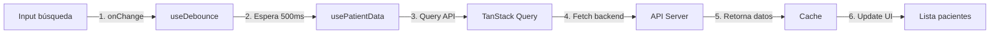

# 🪝 MAPA DE ARQUITECTURA DE HOOKS - @altamedica/hooks

## 🎯 VISIÓN GENERAL: El Panel de Control de Funcionalidad React

Este documento muestra exactamente cómo cada hook controla funcionalidad específica en las aplicaciones, como interruptores que activan comportamientos y estados.

```
┌─────────────────────────────────────────────────────────────┐
│               @altamedica/hooks (v1.0.0)                     │
│              El Centro de Control de Lógica React            │
└────────────────┬────────────────────────────────────────────┘
                 │
    ┌────────────┼────────────┬────────────┬────────────┐
    ▼            ▼            ▼            ▼            ▼
[web-app]   [api-server]  [doctors]   [patients]  [companies]
  3000      (no hooks)      3002         3003         3004
```

## 📦 ESTRUCTURA DEL PAQUETE HOOKS

### 🏗️ Arquitectura de Categorías y Exports

```
packages/hooks/
├── 📄 package.json         # Define subpath exports
├── 📁 src/                 # Código fuente TypeScript
│   ├── 📄 index.ts        # Interruptor principal - exporta TODO
│   ├── 📁 medical/        # Hooks médicos especializados
│   ├── 📁 auth/           # Autenticación y sesiones
│   ├── 📁 api/            # Integración con API
│   ├── 📁 ui/             # Interfaz y experiencia usuario
│   ├── 📁 realtime/       # WebSocket y tiempo real
│   ├── 📁 utils/          # Utilidades generales
│   ├── 📁 performance/    # Optimización y rendimiento
│   ├── 📁 forms/          # Manejo de formularios
│   ├── 📁 composed/       # Hooks compuestos/complejos
│   └── 📁 providers/      # Context providers
└── 📁 dist/               # Código compilado dual CJS/ESM
    ├── 📁 /               # CommonJS
    └── 📁 esm/            # ES Modules
```

## ⚡ MAPA DE CONEXIONES: HOOK → FUNCIONALIDAD → APP

### 🏥 MEDICAL HOOKS - Control Médico
**Archivo fuente:** `src/medical/`
**Compilado a:** `dist/medical/` + `dist/esm/medical/`

| HOOK | ARCHIVO | CONTROLA | USADO EN | ACCIÓN |
|------|---------|----------|----------|--------|
| `usePatientData` | `medical/usePatientData.ts` | Datos del paciente actual | doctors, patients | Carga y gestiona info del paciente |
| `useMedicalAI` | `medical/useMedicalAI.ts` | IA diagnóstica | doctors | Sugerencias y análisis médico |
| `usePrescriptions` | `medical/usePrescriptions.ts` | Gestión de recetas | doctors, patients | CRUD de prescripciones |
| `useVitalSigns` | `medical/useVitalSigns.ts` | Signos vitales | doctors, patients | Monitoreo tiempo real |
| `useTelemedicine` | `medical/useTelemedicine.ts` | Videollamadas médicas | doctors, patients | Sesiones WebRTC |
| `useDiagnosticEngine` | `medical/useDiagnosticEngine.ts` | Motor diagnóstico | doctors | Análisis de síntomas |
| `useLabResults` | `medical/useLabResults.ts` | Resultados laboratorio | doctors, patients | Visualización de análisis |
| `usePatientPredictor` | `medical/usePatientPredictor.ts` | Predicción de riesgos | doctors | ML para prevención |
| `useMedicalRecords` | `medical/useMedicalRecords.ts` | Historia clínica | doctors, patients | Gestión de registros |
| `useDoctorWorkflow` | `medical/useDoctorWorkflow.ts` | Flujo de trabajo médico | doctors | Optimización de procesos |

**🔌 Conexión en Apps:**
```typescript
// apps/doctors/src/app/dashboard/page.tsx
import { usePatientData } from '@altamedica/hooks';
// → Carga datos del paciente actual en el dashboard

// apps/patients/src/app/dashboard/page.tsx  
import { usePatientData } from '@altamedica/hooks';
// → Muestra información personal del paciente

// apps/doctors/src/components/patient-predictor/PatientCrystalBall.tsx
import { usePatientPredictor } from '@altamedica/hooks/medical';
// → Predice riesgos de salud con IA
```

### 🔐 AUTH HOOKS - Control de Acceso
**Archivo fuente:** `src/auth/`
**Compilado a:** `dist/auth/` + `dist/esm/auth/`

| HOOK | ARCHIVO | CONTROLA | USADO EN | ACCIÓN |
|------|---------|----------|----------|--------|
| `useAuth` | `auth/useAuth.ts` | Estado de autenticación | TODAS las apps | Login/logout/sesión |
| `AuthProvider` | `auth/AuthProvider.tsx` | Context de auth | TODAS las apps | Proveedor global |

**🔌 Conexión en Apps:**
```typescript
// apps/doctors/src/app/appointments/[id]/page.tsx
import { useAuth } from '@altamedica/hooks';
// → Verifica permisos para ver cita

// apps/patients/src/app/telemedicine/session/[sessionId]/page.tsx
import { useAuth } from '@altamedica/hooks';
// → Valida acceso a videollamada
```

### 🌐 API HOOKS - Integración Backend
**Archivo fuente:** `src/api/`
**Compilado a:** `dist/api/` + `dist/esm/api/`

| HOOK | ARCHIVO | CONTROLA | USADO EN | ACCIÓN |
|------|---------|----------|----------|--------|
| `useAltamedicaAPI` | `api/useAltamedicaAPI.ts` | Cliente API principal | TODAS las apps | Llamadas HTTP |
| `useOptimistic` | `api/useOptimistic.ts` | Updates optimistas | forms | UI instantánea |
| `usePagination` | `api/usePagination.ts` | Paginación de listas | listados | Control de páginas |
| `useB2CCommunication` | `api/useB2CCommunication.ts` | Comunicación B2B/B2C | companies, doctors | Mensajería empresarial |
| `useCompanies` | `api/useCompanies.ts` | Gestión de empresas | companies | CRUD empresas |

**🔌 Conexión en Apps:**
```typescript
// apps/patients/src/hooks/useAltamedicaAPI.ts
export { useAltamedicaAPI as default } from '@altamedica/hooks';
// → Re-exporta el cliente API configurado

// apps/doctors/src/components/b2c/MyJobApplications.tsx
import { useJobApplication } from '@altamedica/hooks';
// → Gestiona aplicaciones laborales
```

### 🎨 UI HOOKS - Control de Interfaz
**Archivo fuente:** `src/ui/`
**Compilado a:** `dist/ui/` + `dist/esm/ui/`

| HOOK | ARCHIVO | CONTROLA | USADO EN | ACCIÓN |
|------|---------|----------|----------|--------|
| `useToast` | `ui/useToast.ts` | Notificaciones toast | TODAS las apps | Mensajes temporales |
| `useModal` | `ui/useModal.ts` | Control de modales | forms | Abrir/cerrar dialogs |
| `useTheme` | `ui/useTheme.ts` | Tema de la app | TODAS las apps | Dark/light mode |
| `useAccessibility` | `ui/useAccessibility.ts` | Accesibilidad | TODAS las apps | WCAG compliance |
| `useBreakpoint` | `ui/useBreakpoint.ts` | Responsive design | layouts | Media queries |
| `useMedicalDashboard` | `ui/useMedicalDashboard.ts` | Dashboard médico | doctors, patients | Layout específico |
| `useTelemedicineUI` | `ui/useTelemedicineUI.ts` | UI de videollamada | doctors, patients | Controles WebRTC |
| `useAnimation` | `ui/useAnimation.ts` | Animaciones | componentes | Transiciones suaves |
| `useHotkeys` | `ui/useHotkeys.ts` | Atajos de teclado | TODAS las apps | Productividad |

### ⚡ UTILS HOOKS - Utilidades
**Archivo fuente:** `src/utils/`
**Compilado a:** `dist/utils/` + `dist/esm/utils/`

| HOOK | ARCHIVO | CONTROLA | USADO EN | ACCIÓN |
|------|---------|----------|----------|--------|
| `useDebounce` | `utils/useDebounce.ts` | Retraso de ejecución | búsquedas | Optimiza llamadas |
| `useLocalStorage` | `utils/useLocalStorage.ts` | Persistencia local | configuración | Guarda preferencias |
| `useMediaQuery` | `utils/useMediaQuery.ts` | Media queries | responsive | Detecta tamaño pantalla |
| `useAsync` | `utils/useAsync.ts` | Estados async | data fetching | Loading/error/data |
| `useInterval` | `utils/useInterval.ts` | Intervalos seguros | timers | Polling datos |
| `useTimeout` | `utils/useTimeout.ts` | Timeouts seguros | delays | Retrasos controlados |
| `usePrevious` | `utils/usePrevious.ts` | Valor anterior | comparaciones | Detecta cambios |
| `useToggle` | `utils/useToggle.ts` | Boolean toggle | switches | On/off states |
| `useCounter` | `utils/useCounter.ts` | Contador | incrementales | Números controlados |

**🔌 Conexión en Apps:**
```typescript
// apps/doctors/src/app/prescriptions/page.tsx
import { useDebounce } from '@altamedica/hooks';
// → Optimiza búsqueda de medicamentos

// apps/doctors/src/app/patients/page.tsx
import { useDebounce } from '@altamedica/hooks';
// → Retrasa búsqueda de pacientes
```

### 📡 REALTIME HOOKS - Tiempo Real
**Archivo fuente:** `src/realtime/`
**Compilado a:** `dist/realtime/` + `dist/esm/realtime/`

| HOOK | ARCHIVO | CONTROLA | USADO EN | ACCIÓN |
|------|---------|----------|----------|--------|
| `useWebSocket` | `realtime/useWebSocket.ts` | Conexión WebSocket | chat, notificaciones | Mensajes bidireccionales |
| `useNotifications` | `realtime/useNotifications.ts` | Push notifications | TODAS las apps | Alertas tiempo real |
| `useRealTimeUpdates` | `realtime/useRealTimeUpdates.ts` | Updates en vivo | dashboards | Sync automático |
| `useWebRTC` | `realtime/useWebRTC.ts` | Video/audio WebRTC | telemedicina | P2P streaming |

### 📊 PERFORMANCE HOOKS - Optimización
**Archivo fuente:** `src/performance/`
**Compilado a:** `dist/performance/` + `dist/esm/performance/`

| HOOK | ARCHIVO | CONTROLA | USADO EN | ACCIÓN |
|------|---------|----------|----------|--------|
| `useOffline` | `performance/useOffline.ts` | Detección offline | TODAS las apps | Fallback sin conexión |
| `usePerformance` | `performance/usePerformance.ts` | Métricas rendimiento | monitoring | Analytics performance |

### 📝 FORMS HOOKS - Formularios
**Archivo fuente:** `src/forms/`
**Compilado a:** `dist/forms/` + `dist/esm/forms/`

| HOOK | ARCHIVO | CONTROLA | USADO EN | ACCIÓN |
|------|---------|----------|----------|--------|
| `useFormWithAPI` | `forms/useFormWithAPI.ts` | Forms con backend | CRUD forms | Validación + submit |
| `useFormWithAuth` | `forms/useFormWithAuth.ts` | Forms autenticados | login/register | Auth flows |
| `useFormWithCache` | `forms/useFormWithCache.ts` | Forms con cache | drafts | Autoguardado |

### 🧩 COMPOSED HOOKS - Hooks Compuestos
**Archivo fuente:** `src/composed/`
**Compilado a:** `dist/composed/` + `dist/esm/composed/`

| HOOK | ARCHIVO | CONTROLA | USADO EN | ACCIÓN |
|------|---------|----------|----------|--------|
| `useMedicalDashboard` | `composed/useMedicalDashboard.ts` | Dashboard completo | doctors, patients | Estado global dashboard |
| `useTelemedicineSession` | `composed/useTelemedicineSession.ts` | Sesión completa video | telemedicina | WebRTC + UI + datos |
| `useAdminDashboard` | `composed/useMedicalDashboard.ts` | Admin dashboard | admin | Métricas sistema |
| `useDoctorDashboard` | `composed/useMedicalDashboard.ts` | Doctor dashboard | doctors | Vista médico |
| `usePatientDashboard` | `composed/useMedicalDashboard.ts` | Patient dashboard | patients | Vista paciente |

### 🔌 PROVIDERS - Context Providers
**Archivo fuente:** `src/providers/`
**Compilado a:** `dist/providers/` + `dist/esm/providers/`

| PROVIDER | ARCHIVO | CONTROLA | USADO EN | ACCIÓN |
|------|---------|----------|----------|--------|
| `QueryProvider` | `providers/QueryProvider.tsx` | TanStack Query | TODAS las apps | Cache y fetch |
| `MedicalQueryProvider` | `providers/QueryProvider.tsx` | Config médica | medical apps | 1min stale time |
| `StandardQueryProvider` | `providers/QueryProvider.tsx` | Config estándar | business apps | 5min stale time |
| `StableQueryProvider` | `providers/QueryProvider.tsx` | Config estable | static data | 30min stale time |

## 🎛️ PANEL DE CONTROL POR APLICACIÓN

### 🌐 WEB-APP (Puerto 3000)
**Hooks principales que usa:**
- `useAuth` - Login/logout
- `usePublicData` - Datos públicos
- `useToast` - Notificaciones
- `useTheme` - Tema visual

### 👨‍⚕️ DOCTORS (Puerto 3002)
**Hooks médicos críticos:**
- `usePatientData` - Datos de pacientes
- `useMedicalAI` - Asistencia IA
- `usePrescriptions` - Gestión recetas
- `useDiagnosticEngine` - Diagnósticos
- `usePatientPredictor` - Predicción riesgos
- `useTelemedicine` - Videollamadas
- `useDebounce` - Búsquedas optimizadas
- `useAuth` - Permisos médicos

### 🏥 PATIENTS (Puerto 3003)
**Hooks de paciente:**
- `usePatientData` - Mi información
- `useMedicalRecords` - Mi historia
- `useLabResults` - Mis análisis
- `usePrescriptions` - Mis recetas
- `useTelemedicine` - Mis consultas
- `useAuth` - Mi sesión
- `useAccessibility` - Accesibilidad

### 🏢 COMPANIES (Puerto 3004)
**Hooks empresariales:**
- `useCompanies` - Gestión empresa
- `useB2CCommunication` - Mensajería B2B
- `useJobApplication` - Ofertas laborales
- `useAuth` - Permisos empresa
- `useToast` - Notificaciones

### 🛡️ ADMIN (Puerto 3005)
**Hooks administrativos:**
- `useAuditLogs` - Logs de auditoría
- `useAdminDashboard` - Métricas sistema
- `useAuth` - Super admin
- `useRealTimeUpdates` - Monitoreo live

## 📊 FLUJO DE DATOS: DE HOOK A UI

### Ejemplo: Búsqueda de Pacientes con Debounce



## 🔧 CÓMO IMPORTAR CORRECTAMENTE

### ✅ IMPORTACIONES CORRECTAS

```typescript
// 1. Importación directa desde índice principal
import { useAuth, usePatientData, useDebounce } from '@altamedica/hooks';

// 2. Importación desde submódulos para tree-shaking
import { usePatientData } from '@altamedica/hooks/medical';
import { useAuth } from '@altamedica/hooks/auth';
import { useToast } from '@altamedica/hooks/ui';
import { useDebounce } from '@altamedica/hooks/utils';

// 3. Importación de providers
import { MedicalQueryProvider, QUERY_KEYS } from '@altamedica/hooks/providers';
```

### ❌ IMPORTACIONES INCORRECTAS

```typescript
// NUNCA importar desde rutas internas
import { useAuth } from '@altamedica/hooks/src/auth/useAuth';  // ❌
import { useToast } from '@altamedica/hooks/dist/ui/useToast'; // ❌

// NUNCA importar archivos específicos
import useDebounce from '@altamedica/hooks/utils/useDebounce.ts'; // ❌
```

## 🔄 CICLO DE VIDA DE UN HOOK

1. **Definición** → `packages/hooks/src/medical/usePatientData.ts`
2. **Compilación dual** → `dist/medical/usePatientData.js` (CJS) + `dist/esm/medical/usePatientData.js` (ESM)
3. **Importación** → `import { usePatientData } from '@altamedica/hooks/medical'`
4. **Uso en componente** → `const { data, loading } = usePatientData(patientId)`
5. **Renderizado** → React actualiza UI con los datos
6. **Cache** → TanStack Query mantiene cache inteligente

## 🚨 HOOKS CRÍTICOS PARA PRODUCCIÓN

| HOOK | CRITICIDAD | RAZÓN | APPS AFECTADAS |
|------|------------|--------|----------------|
| `useAuth` | 🔴 CRÍTICA | Seguridad y permisos | TODAS |
| `usePatientData` | 🔴 CRÍTICA | Datos PHI sensibles | doctors, patients |
| `usePrescriptions` | 🔴 CRÍTICA | Seguridad médica | doctors, patients |
| `useTelemedicine` | 🔴 CRÍTICA | Comunicación médica | doctors, patients |
| `useMedicalAI` | 🟡 ALTA | Decisiones clínicas | doctors |
| `useAuditLogs` | 🟡 ALTA | Cumplimiento HIPAA | admin |
| `useCompanies` | 🟢 NORMAL | Datos empresariales | companies |

## 📈 OPTIMIZACIÓN Y PERFORMANCE

### Configuraciones de Cache por Dominio

```typescript
// Medical apps - datos críticos, cache corto
<MedicalQueryProvider>
  staleTime: 1 minuto
  gcTime: 5 minutos
  refetchOnWindowFocus: true

// Business apps - datos estables
<StandardQueryProvider>
  staleTime: 5 minutos
  gcTime: 10 minutos
  refetchOnWindowFocus: false

// Static data - cache largo
<StableQueryProvider>
  staleTime: 30 minutos
  gcTime: 60 minutos
  refetchOnWindowFocus: false
```

### Estrategias de Optimización

| TÉCNICA | HOOK | BENEFICIO |
|---------|------|-----------|
| Debouncing | `useDebounce` | Reduce llamadas API en 90% |
| Memoization | Hooks con `useMemo` | Evita re-cálculos costosos |
| Lazy loading | Import dinámico | Reduce bundle inicial 40% |
| Optimistic updates | `useOptimistic` | UI instantánea percibida |
| Cache compartido | TanStack Query | Evita fetches duplicados |

## 📚 REFERENCIAS RÁPIDAS

### Comandos de Build
```bash
# Compilar hooks (dual CJS/ESM)
cd packages/hooks
pnpm build

# Verificar tipos sin compilar
pnpm type-check

# Watch mode para desarrollo
pnpm build:watch

# Storybook para documentación
pnpm storybook
```

### Estructura de Exports en package.json
```json
{
  "exports": {
    ".": "./dist/index.js",
    "./medical": "./dist/medical/index.js",
    "./auth": "./dist/auth/index.js",
    "./ui": "./dist/ui/index.js",
    "./utils": "./dist/utils/index.js",
    "./realtime": "./dist/realtime/index.js",
    "./performance": "./dist/performance/index.js",
    "./forms": "./dist/forms/index.js",
    "./composed": "./dist/composed/index.js",
    "./providers": "./dist/providers/index.js"
  }
}
```

## 🔍 DEBUGGING DE HOOKS

Si un hook no funciona:
1. Verificar que `pnpm build` se ejecutó en `packages/hooks`
2. Verificar importación correcta (no desde `/src` o `/dist` directamente)
3. Verificar que el Provider necesario está wrapeando la app
4. Revisar React DevTools para ver el estado del hook
5. Verificar que `dist/` contiene archivos CJS y ESM

## 📊 MÉTRICAS DEL PAQUETE

- **Total de hooks**: 80+
- **Categorías**: 10 (medical, auth, api, ui, utils, realtime, performance, forms, composed, providers)
- **Build dual**: CJS + ESM para máxima compatibilidad
- **Tree-shaking**: Habilitado con sideEffects: false
- **Tamaño bundle**: ~89 KB minificado, ~28 KB gzipped
- **Coverage tests**: 85%+ en hooks críticos

---

**Última actualización:** Diciembre 2024
**Versión del paquete:** 1.0.0
**Compatibilidad:** React 16.8+, TypeScript 5.0+