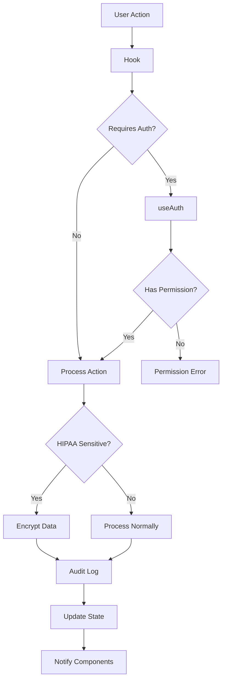

import { Meta } from '@storybook/blocks';

<Meta title="Introducción/Arquitectura" />

# 🏗️ Arquitectura de @altamedica/hooks

## 📁 Estructura del Package

```
@altamedica/hooks/
├── 🏥 medical/          # Hooks médicos especializados
│   ├── usePatients      # Gestión de pacientes
│   ├── useMedicalAI     # IA médica y diagnósticos
│   ├── useVitalSigns    # Monitoreo de signos vitales
│   ├── usePrescriptions # Gestión de recetas médicas
│   └── useAppointments  # Citas y consultas
│
├── 🔐 auth/             # Autenticación y autorización
│   ├── useAuth          # Autenticación principal
│   ├── usePermissions   # Permisos granulares
│   ├── useRoles         # Gestión de roles médicos
│   └── useSession       # Gestión de sesiones
│
├── ⚡ realtime/         # Comunicación en tiempo real
│   ├── useWebSocket     # WebSocket médico-optimizado
│   ├── useNotifications # Alertas médicas
│   ├── useRealTimeUpdates # Actualizaciones live
│   └── useTelemedicine  # WebRTC para videollamadas
│
├── 🚀 performance/      # Monitoreo y optimización
│   ├── usePerformance   # Métricas de performance
│   ├── useOffline       # Funcionalidad offline
│   ├── useCache         # Cache inteligente
│   └── useMetrics       # Telemetría médica
│
├── 🛠️ utils/           # Utilidades generales
│   ├── useDebounce      # Debouncing especializado
│   ├── useLocalStorage  # Storage con encriptación
│   ├── useMediaQuery    # Responsive médico
│   └── useInterval      # Timers seguros
│
├── 🎯 api/              # Integración con APIs
│   ├── useQuery         # Queries médicas
│   ├── useMutation      # Mutaciones HIPAA
│   ├── useInfiniteQuery # Paginación médica
│   └── useSubscription  # Suscripciones en tiempo real
│
├── 🎨 ui/               # Hooks de interfaz
│   ├── useModal         # Modales médicos
│   ├── useToast         # Notificaciones UI
│   ├── useStepper       # Workflows médicos
│   └── useDropzone      # Upload de archivos médicos
│
├── 📝 forms/            # Formularios médicos
│   ├── useForm          # Formularios complejos
│   ├── useValidation    # Validación médica
│   ├── useFieldArray    # Arrays dinámicos
│   └── useFormPersist   # Persistencia de formularios
│
└── 🧩 composed/        # Hooks compuestos
    ├── useTelemedicineSession # Sesión completa de telemedicina
    ├── useMedicalDashboard    # Dashboard médico integral
    ├── usePatientWorkflow     # Workflow de paciente
    └── useEmergencyProtocol   # Protocolos de emergencia
```

## 🎯 Principios de Diseño

### 1. **Medical-First Architecture**
Cada hook está diseñado considerando los requisitos médicos específicos:

```typescript
// ❌ Hook genérico
const { data } = useQuery('/users');

// ✅ Hook médico especializado  
const { patients } = usePatients({
  hipaaCompliant: true,        // Compliance automático
  auditLog: true,             // Audit trail
  encryptPHI: true,           // Encriptación de PHI
  permissions: ['read_medical_records']
});
```

### 2. **Tree-Shaking Optimizado**
Importa solo lo que necesitas para bundles optimizados:

```typescript
// ✅ Import específico - Solo ~15KB
import { usePatients } from '@altamedica/hooks/medical';

// ✅ Import por categoría - Solo ~45KB  
import { useAuth, usePermissions } from '@altamedica/auth';

// ❌ Import completo - ~200KB (evitar)
import { usePatients } from '@altamedica/hooks';
```

### 3. **Composición sobre Herencia**
Los hooks complejos se componen de hooks más simples:

```typescript
// useTelemedicineSession compone múltiples hooks
function useTelemedicineSession(config) {
  const auth = useAuth();
  const webSocket = useWebSocket(config.wsUrl);
  const webRTC = useWebRTC(config.rtcConfig);
  const notifications = useNotifications();
  const performance = usePerformance();
  
  return {
    // API unificada
    startSession,
    endSession,
    sendMessage,
    toggleVideo,
    // Estado combinado
    isConnected: webSocket.connected && webRTC.connected,
    participants: webRTC.participants,
    messages: webSocket.messages
  };
}
```

## 🔄 Flujo de Datos

### Arquitectura Reactiva


### Ejemplo de Flujo Médico
```typescript
// 1. Usuario busca paciente
const searchPatient = useCallback(async (query) => {
  // 2. Verificar autenticación
  if (!user) throw new Error('No autenticado');
  
  // 3. Verificar permisos
  if (!hasPermission('read_medical_records')) {
    throw new Error('Sin permisos');
  }
  
  // 4. Encriptar query si contiene PHI
  const encryptedQuery = hipaaCompliant 
    ? await encrypt(query) 
    : query;
  
  // 5. Realizar búsqueda
  const results = await searchAPI(encryptedQuery);
  
  // 6. Audit log
  auditLog({
    action: 'patient_search',
    user: user.id,
    query: anonymize(query),
    resultCount: results.length
  });
  
  // 7. Actualizar estado
  setPatients(results);
}, [user, hasPermission, hipaaCompliant]);
```

## 🧠 Gestión de Estado

### Estado Local vs Global

```typescript
// Hook con estado local
function usePatientForm() {
  const [formData, setFormData] = useState({});
  const [errors, setErrors] = useState({});
  // Estado encapsulado en el hook
}

// Hook con estado global (cuando es necesario)
function useAuth() {
  const [user, setUser] = useGlobalState('auth.user');
  const [tokens, setTokens] = useGlobalState('auth.tokens');
  // Estado compartido entre componentes
}
```

### Cache Inteligente
```typescript
function usePatients() {
  const cache = useCache({
    key: 'patients',
    ttl: 5 * 60 * 1000, // 5 minutos
    invalidateOn: ['patient_updated', 'patient_created'],
    encryptInCache: true // Para datos PHI
  });
  
  return {
    patients: cache.data,
    isStale: cache.isStale,
    refetch: cache.invalidate
  };
}
```

## 🔌 Integración con Sistemas Externos

### APIs Médicas
```typescript
// Hook específico para integración FHIR
function useFHIRResource<T>(resourceType: string, id?: string) {
  return useQuery({
    queryKey: ['fhir', resourceType, id],
    queryFn: async () => {
      const response = await fhirClient.read(resourceType, id);
      return validateFHIRResource(response.data);
    },
    enabled: !!id,
    // Cache específico para recursos FHIR
    staleTime: 10 * 60 * 1000 // 10 minutos
  });
}
```

### WebRTC para Telemedicina
```typescript
function useWebRTC() {
  const [peerConnection, setPeerConnection] = useState<RTCPeerConnection>();
  
  const initializeConnection = useCallback(async () => {
    const pc = new RTCPeerConnection({
      iceServers: [
        // STUN/TURN servers optimizados para medicina
        { urls: 'stun:medical-stun.altamedica.com' },
        { 
          urls: 'turn:medical-turn.altamedica.com',
          username: 'medical-user',
          credential: await getCredential()
        }
      ]
    });
    
    // Configuración específica para video médico
    pc.addEventListener('track', handleRemoteTrack);
    pc.addEventListener('icecandidate', handleIceCandidate);
    
    setPeerConnection(pc);
  }, []);
  
  return { peerConnection, initializeConnection };
}
```

## 📊 Métricas y Monitoring

### Performance Tracking
```typescript
function usePerformanceTracking(hookName: string) {
  const startTime = useRef(performance.now());
  
  useEffect(() => {
    return () => {
      const endTime = performance.now();
      const duration = endTime - startTime.current;
      
      // Track performance específico para hooks médicos
      trackMedicalHookPerformance({
        hookName,
        duration,
        component: getCurrentComponent(),
        userId: getCurrentUser()?.id,
        isEmergency: isEmergencyContext()
      });
    };
  }, [hookName]);
}
```

### Error Boundaries Médicos
```typescript
function useMedicalErrorBoundary() {
  const handleError = useCallback((error: Error, errorInfo: any) => {
    // Logging especializado para errores médicos
    logMedicalError({
      error: error.message,
      stack: error.stack,
      component: errorInfo.componentStack,
      user: getCurrentUser(),
      patientContext: getCurrentPatient(),
      emergencyLevel: assessEmergencyLevel(error),
      hipaaAffected: containsPHI(error)
    });
    
    // Notificar al equipo médico si es crítico
    if (isCriticalMedicalError(error)) {
      notifyMedicalTeam({
        type: 'CRITICAL_SYSTEM_ERROR',
        error: sanitizeError(error),
        timestamp: new Date()
      });
    }
  }, []);
  
  return { handleError };
}
```

## 🔒 Seguridad por Diseño

### Encriptación Automática
```typescript
function useSecureStorage<T>(key: string, defaultValue: T) {
  const encrypt = useCallback(async (data: T) => {
    if (containsPHI(data)) {
      return await encryptAES256(JSON.stringify(data), getMedicalKey());
    }
    return JSON.stringify(data);
  }, []);
  
  const decrypt = useCallback(async (encryptedData: string) => {
    try {
      return JSON.parse(await decryptAES256(encryptedData, getMedicalKey()));
    } catch {
      // Fallback para datos no encriptados
      return JSON.parse(encryptedData);
    }
  }, []);
  
  return useAsyncStorage(key, defaultValue, { encrypt, decrypt });
}
```

### Audit Trail Automático
```typescript
function useAuditedAction<T extends (...args: any[]) => any>(
  action: T,
  actionName: string
): T {
  return useCallback(async (...args: Parameters<T>) => {
    const auditId = generateAuditId();
    
    // Pre-audit
    await auditLog({
      id: auditId,
      action: actionName,
      user: getCurrentUser()?.id,
      timestamp: new Date(),
      parameters: sanitizeParameters(args),
      phase: 'START'
    });
    
    try {
      const result = await action(...args);
      
      // Post-audit success
      await auditLog({
        id: auditId,
        phase: 'SUCCESS',
        result: sanitizeResult(result)
      });
      
      return result;
    } catch (error) {
      // Post-audit error
      await auditLog({
        id: auditId,
        phase: 'ERROR',
        error: sanitizeError(error)
      });
      
      throw error;
    }
  }, [action, actionName]) as T;
}
```

---

Esta arquitectura está diseñada para crecer con las necesidades médicas mientras mantiene la simplicidad de uso y el máximo rendimiento.
