# 🗺️ MAPA DE ARQUITECTURA DE TIPOS - @altamedica/types

## 🎯 VISIÓN GENERAL: El Sistema de Circuitos de Tipos

Este documento muestra exactamente cómo cada tipo controla cada aplicación, como un panel de control eléctrico donde cada interruptor tiene un propósito específico.

```
┌─────────────────────────────────────────────────────────────┐
│                 @altamedica/types (v1.0.0)                   │
│                    El Panel de Control Central                │
└────────────────┬────────────────────────────────────────────┘
                 │
    ┌────────────┼────────────┬────────────┬────────────┐
    ▼            ▼            ▼            ▼            ▼
[web-app]   [api-server]  [doctors]   [patients]  [companies]
  3000         3001         3002         3003         3004
```

## 📦 ESTRUCTURA DEL PAQUETE TYPES

### 🏗️ Arquitectura de Archivos y Exports

```
packages/types/
├── 📄 package.json         # Define todos los puntos de entrada
├── 📁 src/                 # Código fuente TypeScript
│   ├── 📄 index.ts        # Interruptor principal - exporta TODO
│   ├── 📁 core/           # Tipos básicos del sistema
│   ├── 📁 medical/        # Dominio médico completo
│   ├── 📁 auth/           # Autenticación y roles
│   ├── 📁 api/            # Contratos de API
│   └── 📁 [otros]/        # Dominios especializados
└── 📁 dist/               # Código compilado JavaScript
```

## ⚡ MAPA DE CONEXIONES: TIPO → APLICACIÓN

### 🔐 AUTH TYPES - Control de Acceso
**Archivo fuente:** `src/auth/`
**Compilado a:** `dist/auth/`

| TIPO | ARCHIVO | CONTROLA | USADO EN |
|------|---------|----------|----------|
| `UserRole` | `auth/roles.ts` | Determina permisos de usuario | TODAS las apps |
| `AuthToken` | `auth/auth-token.ts` | Token JWT para sesiones | api-server → todas |
| `SSOLoginRequest` | `auth/auth-token.ts` | Login unificado | web-app → api-server |
| `AuthContext` | `auth/auth-token.ts` | Estado de autenticación | Context providers |

**🔌 Conexión en Apps:**
```typescript
// apps/web-app/src/auth/login.tsx
import { SSOLoginRequest, UserRole } from '@altamedica/types';
// → Al hacer login, valida el rol y redirige

// apps/api-server/src/auth/UnifiedAuthSystem.ts
import { AuthToken, AuthContext } from '@altamedica/types';
// → Valida tokens y genera contexto de sesión
```

### 🏥 MEDICAL TYPES - Datos Clínicos
**Archivo fuente:** `src/medical/`
**Compilado a:** `dist/medical/`

| TIPO | ARCHIVO | CONTROLA | USADO EN |
|------|---------|----------|----------|
| `Patient` | `medical/patient/patient.types.ts` | Datos del paciente | patients, doctors, api-server |
| `Doctor` | `medical/doctor/doctor.types.ts` | Perfil médico | doctors, companies |
| `Appointment` | `medical/clinical/appointment.types.ts` | Citas médicas | TODAS excepto web-app |
| `VitalSigns` | `medical/clinical/appointment.types.ts` | Signos vitales | patients, doctors |
| `MedicalHistory` | `medical/clinical/medical-history.types.ts` | Historia clínica | patients, doctors |
| `Prescription` | `prescription.ts` | Recetas médicas | doctors, patients |
| `LabResult` | `medical/clinical/lab-result.types.ts` | Resultados de laboratorio | doctors, patients |

**🔌 Conexión en Apps:**
```typescript
// apps/patients/src/hooks/useMedicalHistory.ts
import { MedicalHistory, LabResult } from '@altamedica/types';
// → Muestra historia clínica del paciente

// apps/doctors/src/components/prescriptions/PrescriptionForm.tsx
import { Prescription, Medication } from '@altamedica/types';
// → Formulario para crear recetas
```

### 🏢 COMPANY/MARKETPLACE TYPES - B2B
**Archivo fuente:** `src/company.ts`, `src/marketplace.ts`
**Compilado a:** `dist/company/`, `dist/marketplace/`

| TIPO | ARCHIVO | CONTROLA | USADO EN |
|------|---------|----------|----------|
| `Company` | `company.ts` | Datos de empresa | companies, api-server |
| `JobOffer` | `company.ts` | Ofertas laborales | companies, doctors |
| `JobApplication` | `b2c/company-doctor-communication.types.ts` | Aplicaciones a trabajos | companies, doctors |
| `CompanyDoctor` | `company.ts` | Relación empresa-doctor | companies |
| `Employee` | `employee.ts` | Datos de empleados | companies, admin |

**🔌 Conexión en Apps:**
```typescript
// apps/companies/src/services/api/JobOffersAPIClient.ts
import { JobOffer, JobApplication } from '@altamedica/types';
// → CRUD de ofertas laborales

// apps/doctors/src/components/b2c/MyJobApplications.tsx
import { JobApplication } from '@altamedica/types';
// → Ver aplicaciones a trabajos
```

### 📡 API TYPES - Contratos de Comunicación
**Archivo fuente:** `src/api/`
**Compilado a:** `dist/api/`

| TIPO | ARCHIVO | CONTROLA | USADO EN |
|------|---------|----------|----------|
| `APIResponse<T>` | `api/response.types.ts` | Formato de respuesta | TODAS las apps |
| `PaginatedResponse<T>` | `api/response.types.ts` | Respuestas paginadas | Listados |
| `APIError` | `api/response.types.ts` | Manejo de errores | Error boundaries |
| `QueryParams` | `api/request.types.ts` | Parámetros de búsqueda | Filtros y búsquedas |

**🔌 Conexión en Apps:**
```typescript
// apps/api-server/src/routes/patients.routes.ts
import { APIResponse, PaginatedResponse } from '@altamedica/types';
// → Formato estándar de respuestas

// apps/patients/src/hooks/usePatients.ts
import { APIResponse, Patient } from '@altamedica/types';
// → Type-safe API calls
```

### 🔒 SECURITY TYPES - Cumplimiento y Seguridad
**Archivo fuente:** `src/security/`
**Compilado a:** `dist/security/`

| TIPO | ARCHIVO | CONTROLA | USADO EN |
|------|---------|----------|----------|
| `HIPAACompliance` | `security/hipaa.types.ts` | Validación HIPAA | api-server |
| `EncryptionConfig` | `security/encryption.types.ts` | Config de encriptación | api-server |
| `AuditLog` | `audit.ts` | Registro de auditoría | api-server, admin |

### 💳 BILLING TYPES - Facturación
**Archivo fuente:** `src/billing.ts`
**Compilado a:** `dist/billing/`

| TIPO | ARCHIVO | CONTROLA | USADO EN |
|------|---------|----------|----------|
| `Invoice` | `billing.ts` | Facturas | companies, api-server |
| `Payment` | `billing.ts` | Pagos | companies, patients |
| `Subscription` | `billing.ts` | Suscripciones | companies |

## 🔧 CÓMO IMPORTAR CORRECTAMENTE

### ✅ IMPORTACIONES CORRECTAS

```typescript
// 1. Importación directa desde el índice principal
import { Patient, Doctor, Appointment } from '@altamedica/types';

// 2. Importación desde submódulos para tree-shaking
import { Patient } from '@altamedica/types/medical/patient';
import { UserRole } from '@altamedica/types/auth';
import { APIResponse } from '@altamedica/types/api';

// 3. Importación de esquemas Zod para validación
import { PatientSchema, AppointmentSchema } from '@altamedica/types/medical';
```

### ❌ IMPORTACIONES INCORRECTAS

```typescript
// NUNCA importar desde rutas internas
import { Patient } from '@altamedica/types/src/medical/patient';  // ❌
import { Doctor } from '@altamedica/types/dist/medical/doctor';   // ❌

// NUNCA importar archivos específicos
import { PatientType } from '@altamedica/types/patient.ts';       // ❌
```

## 📊 FLUJO DE DATOS: DE TIPO A UI

### Ejemplo: Creación de Cita Médica

```mermaid
graph LR
    A[doctors app] -->|1. Usa tipo Appointment| B[Formulario]
    B -->|2. Valida con AppointmentSchema| C[API Call]
    C -->|3. POST con tipo CreateAppointmentDTO| D[api-server]
    D -->|4. Valida y guarda| E[Database]
    E -->|5. Retorna APIResponse<Appointment>| F[doctors app]
    F -->|6. Actualiza UI con tipo| G[Vista]
```



## 🎛️ PANEL DE CONTROL POR APLICACIÓN

### 🌐 WEB-APP (Puerto 3000)
**Tipos principales que controla:**
- `SSOLoginRequest` - Login
- `UserRole` - Redirección por rol
- `AuthContext` - Estado de sesión

### 🔧 API-SERVER (Puerto 3001)
**Tipos que valida y procesa:**
- TODOS los tipos (es el validador central)
- Especialmente: `AuthToken`, `AuditLog`, schemas Zod

### 👨‍⚕️ DOCTORS (Puerto 3002)
**Tipos que maneja:**
- `Doctor` - Perfil propio
- `Patient` - Pacientes asignados
- `Appointment` - Gestión de citas
- `Prescription` - Creación de recetas
- `JobApplication` - Aplicaciones laborales

### 🏥 PATIENTS (Puerto 3003)
**Tipos que consume:**
- `Patient` - Perfil propio
- `MedicalHistory` - Historia clínica
- `Appointment` - Mis citas
- `LabResult` - Resultados
- `Prescription` - Mis recetas

### 🏢 COMPANIES (Puerto 3004)
**Tipos que gestiona:**
- `Company` - Datos empresa
- `JobOffer` - Ofertas laborales
- `Employee` - Empleados
- `CompanyDoctor` - Doctores afiliados
- `Invoice` - Facturación

### 🛡️ ADMIN (Puerto 3005)
**Tipos que supervisa:**
- `AuditLog` - Logs del sistema
- `UserRole` - Gestión de permisos
- Todos los tipos para monitoreo

## 📝 VALIDACIÓN CON SCHEMAS ZOD

Cada tipo tiene su esquema Zod correspondiente para validación:

```typescript
// Tipo TypeScript
export interface Patient {
  id: string;
  name: string;
  email: string;
}

// Schema Zod para validación
export const PatientSchema = z.object({
  id: z.string().uuid(),
  name: z.string().min(1),
  email: z.string().email()
});

// Uso en API
const validatedData = PatientSchema.parse(requestBody);
```

## 🔄 CICLO DE VIDA DE UN TIPO

1. **Definición** → `packages/types/src/medical/patient.types.ts`
2. **Compilación** → `packages/types/dist/medical/patient.js`
3. **Importación** → `import { Patient } from '@altamedica/types'`
4. **Validación** → `PatientSchema.parse(data)`
5. **Uso en UI** → `const patient: Patient = usePatient()`
6. **Persistencia** → `await savePatient(patient)`

## 🚨 TIPOS CRÍTICOS PARA PRODUCCIÓN

| TIPO | CRITICIDAD | RAZÓN |
|------|------------|--------|
| `AuthToken` | 🔴 CRÍTICA | Seguridad de sesiones |
| `Patient` | 🔴 CRÍTICA | Datos PHI sensibles |
| `Prescription` | 🔴 CRÍTICA | Seguridad médica |
| `AuditLog` | 🟡 ALTA | Cumplimiento HIPAA |
| `Invoice` | 🟡 ALTA | Datos financieros |
| `Company` | 🟢 NORMAL | Datos públicos |

## 📚 REFERENCIAS RÁPIDAS

### Comandos de Build
```bash
# Compilar tipos
cd packages/types
pnpm build

# Verificar tipos sin compilar
pnpm type-check

# Watch mode para desarrollo
pnpm build:watch
```

### Estructura de Exports en package.json
```json
{
  "exports": {
    ".": "./dist/index.js",
    "./medical": "./dist/medical/index.js",
    "./auth": "./dist/auth/index.js",
    "./api": "./dist/api/index.js"
  }
}
```

## 🔍 DEBUGGING DE TIPOS

Si un tipo no se encuentra:
1. Verificar que `pnpm build` se ejecutó en `packages/types`
2. Verificar que el export existe en `src/index.ts`
3. Verificar la ruta de importación
4. Verificar que `dist/` contiene los archivos compilados

---

**Última actualización:** Diciembre 2024
**Versión del paquete:** 1.0.0
**Compatibilidad:** TypeScript 5.0+